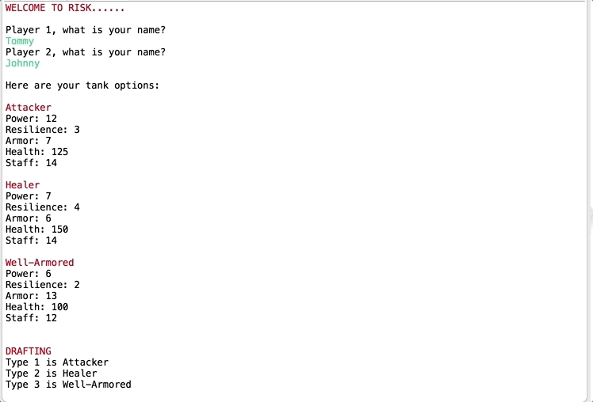

# BattleTank - built with Java

BattleTank has become one of my favorite projects because of the way it brings life to an ordinary console.

## Attacking
Players choose which tank they want to attack with, the dice amount they want to roll (dependent on a tank's Staff), and based on attributes like the attacking tank's Power and the defending tank's Armor, damage is dealt.

## Defending
Players then have a chance to rebuild the health of their damaged tank. How much they can heal a tank is dependent on the tank's overall Resilience and their current remaining Staff.

